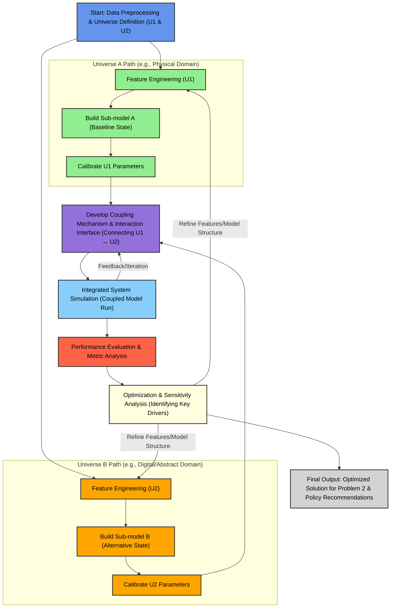

```mermaid
graph TD
    %% 定义节点与样式
    StartDataPreprocessing["Start: Data Preprocessing & Universe Definition (U1 & U2)"]
    style StartDataPreprocessing fill:#6495ED,stroke:#333,stroke-width:2px,color:#000

    subgraph "Universe A Path (e.g., Physical Domain)"
        direction TB
        FeatureEngineeringU1["Feature Engineering (U1)"]
        BuildSubmodelA["Build Sub-model A (Baseline State)"]
        CalibrateU1Params["Calibrate U1 Parameters"]
        style FeatureEngineeringU1 fill:#90EE90,stroke:#333,stroke-width:2px,color:#000
        style BuildSubmodelA fill:#90EE90,stroke:#333,stroke-width:2px,color:#000
        style CalibrateU1Params fill:#90EE90,stroke:#333,stroke-width:2px,color:#000
    end

    subgraph "Universe B Path (e.g., Digital/Abstract Domain)"
        direction TB
        FeatureEngineeringU2["Feature Engineering (U2)"]
        BuildSubmodelB["Build Sub-model B (Alternative State)"]
        CalibrateU2Params["Calibrate U2 Parameters"]
        style FeatureEngineeringU2 fill:#FFA500,stroke:#333,stroke-width:2px,color:#000
        style BuildSubmodelB fill:#FFA500,stroke:#333,stroke-width:2px,color:#000
        style CalibrateU2Params fill:#FFA500,stroke:#333,stroke-width:2px,color:#000
    end

    DevelopCouplingMechanism["Develop Coupling Mechanism & Interaction Interface (Connecting U1 ↔ U2)"]
    style DevelopCouplingMechanism fill:#9370DB,stroke:#333,stroke-width:2px,color:#000

    IntegratedSystemSimulation["Integrated System Simulation (Coupled Model Run)"]
    style IntegratedSystemSimulation fill:#87CEFA,stroke:#333,stroke-width:2px,color:#000

    PerformanceEvaluation["Performance Evaluation & Metric Analysis"]
    style PerformanceEvaluation fill:#FF6347,stroke:#333,stroke-width:2px,color:#000

    OptimizationSensitivityAnalysis["Optimization & Sensitivity Analysis (Identifying Key Drivers)"]
    style OptimizationSensitivityAnalysis fill:#FFFFE0,stroke:#333,stroke-width:2px,color:#000

    FinalOutput["Final Output: Optimized Solution for Problem 2 & Policy Recommendations"]
    style FinalOutput fill:#D3D3D3,stroke:#333,stroke-width:2px,color:#000

    %% 定义连接关系
    StartDataPreprocessing --> FeatureEngineeringU1
    StartDataPreprocessing --> FeatureEngineeringU2

    FeatureEngineeringU1 --> BuildSubmodelA
    BuildSubmodelA --> CalibrateU1Params
    CalibrateU1Params --> DevelopCouplingMechanism

    FeatureEngineeringU2 --> BuildSubmodelB
    BuildSubmodelB --> CalibrateU2Params
    CalibrateU2Params --> DevelopCouplingMechanism

    DevelopCouplingMechanism --> IntegratedSystemSimulation
    IntegratedSystemSimulation --> PerformanceEvaluation
    PerformanceEvaluation --> OptimizationSensitivityAnalysis
    OptimizationSensitivityAnalysis --> FinalOutput

    %% 反馈与迭代
    OptimizationSensitivityAnalysis -->|Refine Features/Model Structure| FeatureEngineeringU1
    OptimizationSensitivityAnalysis -->|Refine Features/Model Structure| FeatureEngineeringU2
    IntegratedSystemSimulation -->|Feedback/Iteration| DevelopCouplingMechanism
```